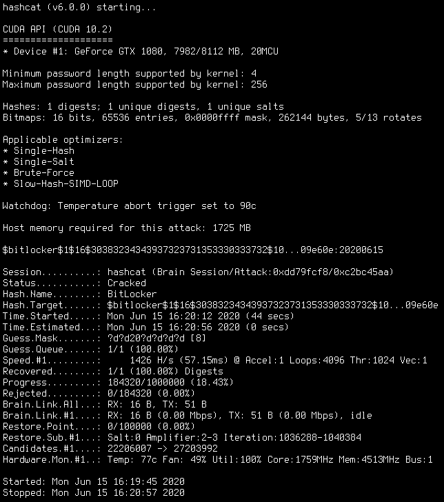

## Mở đầu

Không phải bàn cãi, **Mật khẩu** *(Password)* có lẽ là thứ căn bản nhất, phổ biến nhất mà hầu như ai ai cũng phải sử dụng khi bước chân vào Internet.

Đại bộ phận người sử dụng mật khẩu chỉ xem nó là một **dãy kí tự đơn thuần** không hơn không kém để tránh người khác truy cập trái phép vào tài khoản cá nhân của mình. Nhưng mấy ai hiểu được, phía sau *"dãy kí tự đơn thuần"* đó là cả một **trò chơi bảo mật** vô cùng phức tạp và chông gai.

Chúng ta sử dụng mật khẩu để bảo vệ chính mình, nhưng không phải ai cũng biết cách đặt một mật khẩu **đủ mạnh** hay là những **lưu ý cần thiết** khi sử dụng mật khẩu. Trong bài viết này, tớ sẽ trình bày tất tần tật những mặt tốt xấu lợi hại của mật khẩu.

Những kiến thức này không phải ai cũng biết và để ý *(nếu không muốn nói là hầu như không)*, và những thứ này cũng **không phải muốn là đọc được đâu,** hầu như rất ít những trang web nào chia sẻ những vấn đề này *(tớ kiếm thử rồi nhưng không hề có)*. Nên các bạn có đọc được bài này thì cũng chịu khó đọc hết nha, chỉ có tốt chứ không mất gì đâu hê hê.

Okay, bắt đầu thuiii.

## Vấn đề

Tớ xin lấy một ví dụ đó là sự kiện ***The Fappenning***, một sự kiện rò rỉ lớn những bức ảnh khỏa thân và bán khỏa thân của Rihanna, Kate Upton,... cùng nhiều người nổi tiếng khác, hầu hết là phụ nữ - các bức ảnh lưu trữ trong điện thoại di động của họ đã bị truy cập từ xa rồi bị chia sẻ trên mạng.

Do tất cả người nổi tiếng đều sử dụng iPhone, nên theo suy đoán ban đầu, đây có lẽ là một cuộc xâm phạm dữ liệu nhắm vào iCloud - dịch vụ lưu trữ đám mây của Apple. Nhưng Apple đã phủ nhận mọi sai sót từ phía họ.

>*Trong các trường hợp mà chúng tôi đã điều tra, không có trường hợp nào xảy ra do hành vi xâm phạm vào các hệ thống của Apple, bao gồm cả iCloud hay ứng dụng Tìm iPhone.*

Sau cùng, Apple tuyên bố sự việc trên là **"cuôc tấn công nhắm vào tên người dùng, mật khẩu và câu hỏi bảo mật"**.

## Mật khẩu đại cương

Để bảo vệ tài khoản iCloud và các tài khoản trược tuyến khác của mình, bạn sẽ phải đặt một **mật khẩu đủ mạnh**. Đó là điều hiển nhiên.

Tuy nhiên, nhiều người lại **không coi trọng** vấn đề này, kể cả các người nổi tiếng hay lãnh đạo các tập đoàn lớn, họ rất lười đặt mật khẩu. Một ví dụ là **Michael Lynton**, Giám đốc Điều hành của hãng **Sony Entertainment**. Ai đời không đâu lại dùng cụm ký tự `sonyml3` làm mật khẩu tài khoản tên miền của mình. Và không có gì ngạc nhiên, email của ông bị tấn công và phát tán trên Internet vì kẻ tấn công nắm được quyền truy cập vào gần như mọi cơ sở dữ liệu trong công ty với vai trò quản trị viên.

Việc chọn một mật khẩu khó đoán không ngăn được các công cụ tấn công như [**Hashcat**](https://github.com/hashcat/hashcat) *(một công cụ hỗ trợ năm phương thức tấn công độc đáo cho hơn 300 thuật toán hashing đã được tối ưu hóa, có hỗ trợ cả CPU lẫn GPU)*, nhưng nó sẽ làm cho quá trình này diễn ra chậm lại, đủ để hacker nản lòng mà chuyển sang mục tiêu khác dễ ăn hơn.

 

Trong danh sách những mật khẩu phổ biến nhất theo **SplashData**, ta có thể kể đến như `123456`,`123456789`,`qwerty`,`password`,`12345678`,`iloveyou`,`admin`,... . Nếu cũng đang sử dụng mấy thứ mật khẩu vớ vẩn như trên kia, thì rất có thể bạn sẽ **trở thành nạn nhân** của các vụ xâm phạm dữ liệu, vì hầu như tất cả các bộ công cụ bẻ khóa mật khẩu hiện nay đều **có sẵn** những cụm từ phổ biến này. Nếu muốn, bạn có thể truy cập trang [**haveibeenpwned.com**](https://haveibeenpwned.com/) để kiểm tra xem tài khoản của mình đã từng bị xâm phạm bao giờ chưa *(tương đối)*.

| Head one | Head two | Head three |
| -------- | ---------| ---------- |
| cell one | cell two | cell three |